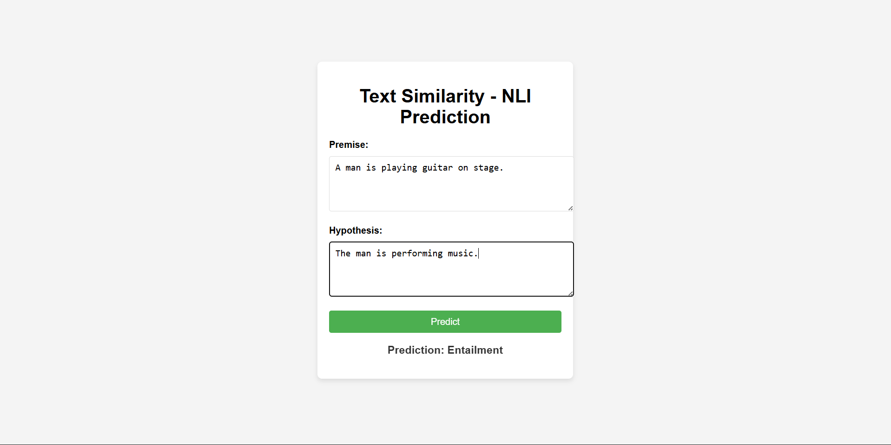

# A4 -- Do You AGREE?

**AT82.05 Artificial Intelligence: Natural Language Understanding
(NLU)**

------------------------------------------------------------------------

## 📌 Overview

This project implements:

1.  BERT from scratch trained with Masked Language Modeling (MLM).
2.  Sentence-BERT (S-BERT) using a siamese architecture with Softmax
    classification objective.
3.  Evaluation using classification metrics (SNLI dataset).
4.  A simple web application demonstrating Natural Language Inference
    (NLI).

------------------------------------------------------------------------

# 🧩 Task 1 -- Training BERT from Scratch

## Objective

Implement Bidirectional Encoder Representations from Transformers (BERT)
from scratch and train using the Masked Language Modeling (MLM)
objective.

## Dataset Used

-   WikiText-103 (raw version)
-   Source: https://huggingface.co/datasets/wikitext
-   Subset used: 100,000 samples

## Model Configuration

-   Hidden size: 256
-   Layers: 4
-   Attention heads: 4
-   Intermediate size: 1024
-   Max sequence length: 128
-   Vocabulary size: 30,000
-   MLM probability: 15%

## Training Settings

-   Epochs: 3
-   Optimizer: AdamW
-   Learning rate: 5e-4
-   Warmup ratio: 0.1
-   Weight decay: 0.01
-   Device: CPU / CUDA (if available)

## Output

Saved artifacts: - artifacts/bert_mlm_model/ -
artifacts/bert_mlm_tokenizer/

------------------------------------------------------------------------

# 🧠 Task 2 -- Sentence-BERT for NLI

## Objective

Use trained BERT encoder in a siamese network structure to derive
sentence embeddings and classify sentence pairs.

## Dataset Used

-   SNLI (Stanford Natural Language Inference)
-   Source: https://huggingface.co/datasets/snli

## Architecture

Two shared-weight BERT encoders:

Sentence A → BERT → pooling → u\
Sentence B → BERT → pooling → v

Classification objective:

o = softmax(W\^T · (u, v, \|u − v\|))

Labels: - entailment - neutral - contradiction

## Training Details

-   Epochs: 2--3
-   Batch size: 16
-   Loss: CrossEntropy (Softmax)
-   Pooling: Mean pooling

## Output

-   artifacts/sbert_nli_model.pt

------------------------------------------------------------------------

# 📊 Task 3 -- Evaluation & Analysis

Evaluation performed on SNLI test set.

### Classification Report

                    precision    recall  f1-score   support

       entailment       0.72      0.79      0.75      3368
          neutral       0.70      0.66      0.68      3219
    contradiction       0.74      0.70      0.72      3237

         accuracy                           0.72      9824
        macro avg       0.72      0.72      0.72      9824
     weighted avg       0.72      0.72      0.72      9824

### Discussion

The model achieves an overall accuracy of **72%** on the SNLI test set.\
Performance across classes is balanced, with slightly higher recall for
entailment (0.79).\
This indicates the model successfully captures semantic relationships
between sentence pairs despite being trained from scratch.

### Limitations

-   Training from scratch on a limited dataset reduces maximum
    achievable performance compared to pretrained BERT.
-   Model size was reduced due to hardware constraints.
-   Training time is significantly longer on CPU-only systems.

### Potential Improvements

-   Increase dataset size
-   Train for more epochs
-   Increase model depth
-   Use larger GPU resources

------------------------------------------------------------------------

# 🌐 Task 4 -- Web Application

A simple Flask web application was developed.

Features: - Two input boxes (Premise & Hypothesis) - Predicts: -
Entailment - Neutral - Contradiction - Displays predicted label and
probabilities

## Run the App

cd app\
pip install -r requirements.txt\
python app.py

Open: http://localhost:8000

### Web Application Screenshot:
   
Below is a screenshot of the running web application:
   
   

------------------------------------------------------------------------

# 📖 References

-   Devlin et al. (2019) -- BERT: Pre-training of Deep Bidirectional
    Transformers
-   Reimers & Gurevych (2019) -- Sentence-BERT
-   WikiText Dataset
-   SNLI Dataset

------------------------------------------------------------------------

✔ Trained BERT from scratch\
✔ Used public dataset with citation\
✔ Implemented S-BERT with Softmax objective\
✔ Provided classification report\
✔ Developed web application\
✔ Included documentation and hyperparameters
